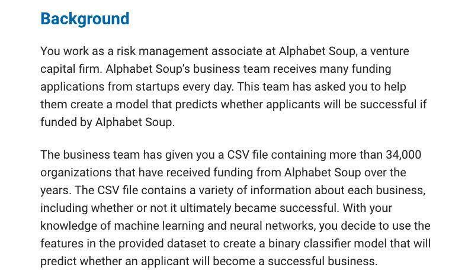
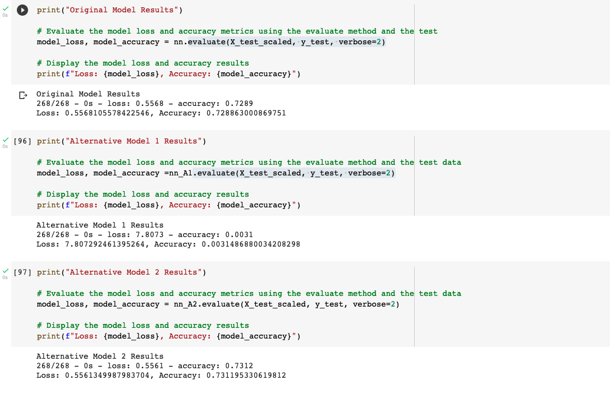

<!-- TABLE OF CONTENTS -->
<details open="open">
  <summary>Table of Contents</summary>
  <ol>
    <li>
      <a href="#about-the-project">About The Project</a>
      <ul>
        <li><a href="#built-with">Built With</a></li>
      </ul>
        <li><a href="#installation">Installation</a></li>
      </ul>
    </li>
    <li><a href="#usage">Usage</a></li>
  </ol>
</details>


<!-- ABOUT THE PROJECT -->
## About The Project



For module 13, the goal is to determine if " Alphabet Soup funding applicants will be successful, you will create a binary classification model using a deep neural network". Using skills such as, "Preprocess data for a neural network model, Use the model-fit-predict pattern to compileevaluate a binary classification model, Optimize the model" 

### Built With

This section should list any major frameworks that you built your project using. Leave any add-ons/plugins for the acknowledgements section. Here are a few examples.
* [Jupyter Notebook](https://jupyter.org/)
* [Python](https://www.python.org/)
* [Google Colab](https://colab.research.google.com/)


### Installation

IMPORTANT: APPLE M1 chip cannot handle TensorFlow or Keras, so all of the work done in this activity is through Google Colab. However with other devices, the installations should work. 

1. Install TensorFlow
 ```
 conda activate dev
 pip install --upgrade tensorflow
 python -c "import tensorflow as tf;print(tf.__version__)"
 ```
  
 2. Install Keras
 ```
 python -c "import tensorflow as tf;print(tf.keras.__version__)"
 ```
 

<!-- USAGE EXAMPLES -->
## Usage




